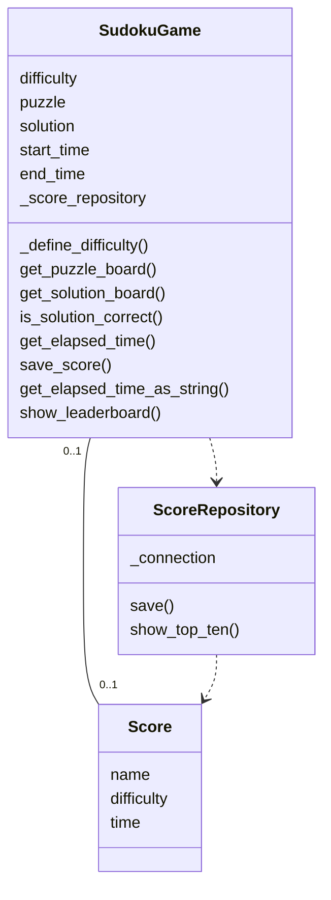
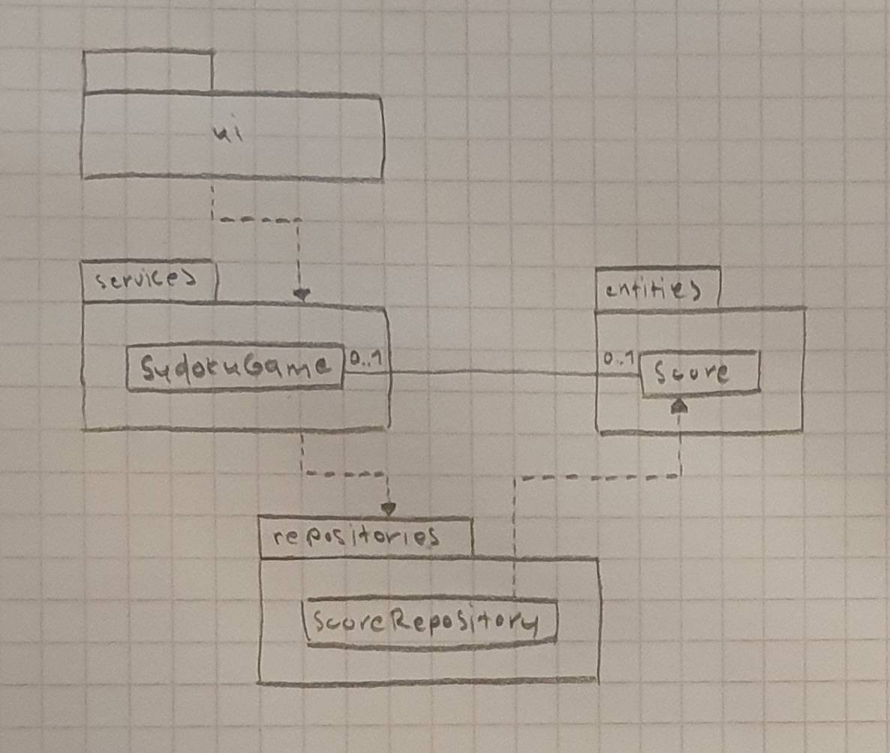
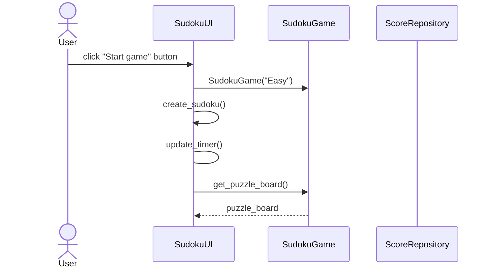
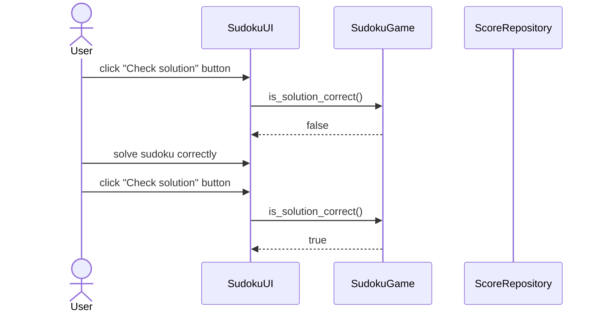

# Arkkitehtuurikuvaus

## Rakenne

Tässä osiossa kuvataan sovelluksen rakennetta luokka- ja pakkauskaaviolla.

### Luokkakaavio

### Pakkauskaavio

## Päätoiminnallisuudet

Tässä osiossa kuvataan sovelluksen toimintalogiikkaa muutaman päätoiminnallisuuden osalta sekvenssikaaviona.

### Uuden pelin aloittaminen

Kun käyttäjä aloittaa uuden pelin, sovelluksen kontrolli etenee seuraavasti:

### Ratkaisun tarkistaminen

Uuden pelin luomisen jälkeen käyttäjä yrittää tarkistaa ei-täytettyä sudokua. Tämän jälkeen hän ratkaisee sudokun oikein ja tarkistaa ratkaisun uudelleen. Tällöin sovelluksen kontrolli etenee seuraavasti:

