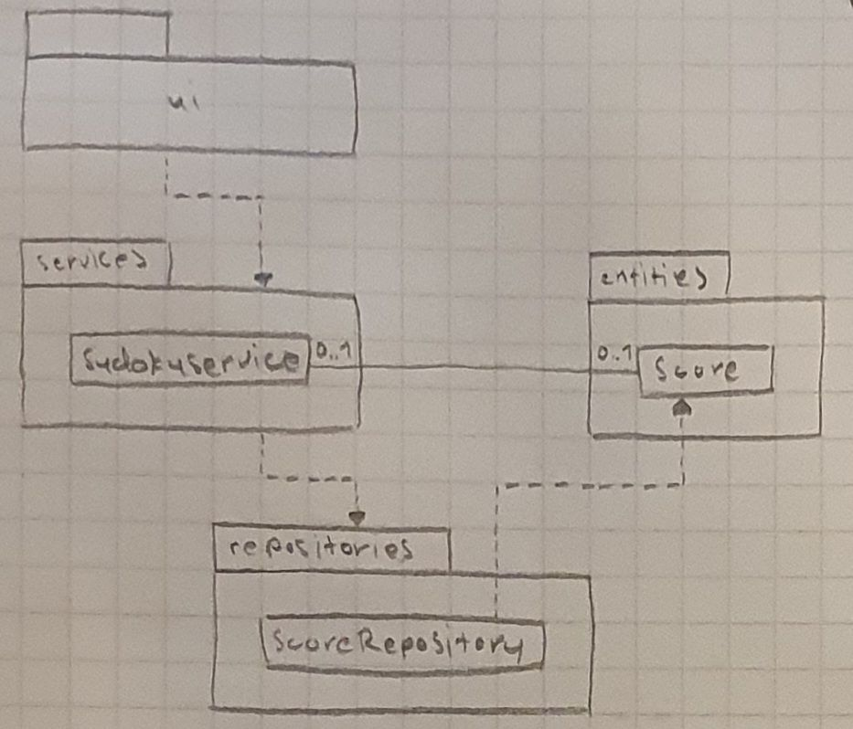

# Arkkitehtuurikuvaus

## Sovelluksen rakenne

Ohjelma noudattaa kolmitasoista kerrosarkkitehtuuria. Alla on kuvattuna sovelluksen rakennetta luokka- ja pakkauskaaviolla.

### Luokkakaavio


### Pakkauskaavio



Pakkaus *ui* sisältää käyttöliittymästä vastaavan koodin, *services* sovelluslogiikasta vastaavan koodin ja *repositories* tietojen pysyväistallennuksesta vastaavan koodin, ja *entities* sisältää erilaisia tietomalleja kuvaavia luokkia.

## Käyttöliittymä

Käyttöliittymä sisältää kolme eri näkymää:
- Päävalikko
- Peliruutu
- Leaderboard

Näistä yksi on aina näkyvissä, ja kaikista näkymistä vastaa SudokuUI-luokka. Käyttöliittymä ja sovelluslogiikka on eroteltu toisistaan mahdollisimman paljon. Käyttöliittymä kutsuu pelkästään luokan SudokuService metodeja.


## Sovelluslogiikka

Sovelluksen ainoana tietomallina toimii luokka Score, joka kuvaa käyttäjien pelituloksia. SudokuService-luokka vastaa sudoku-pelin luomisesta ja tarjoaa joillekin käyttöliittymän toiminnoille oman metodin. Se käsittelee lisäksi pelituloksia luokan ScoreRepository kautta.

## Tietojen pysyväistallennus

ScoreRepository-luokka huolehtii kaikesta sovellukseen liittyvästä tietojen tallettamisesta. Kaikki tieto tallentuu SQLite-tietokantatauluun `scores`.

Sovelluksen juuressa oleva konfiguraatiotiedosto .env määrittelee tietokannan tiedoston nimen.


## Päätoiminnallisuudet

Tässä osiossa kuvataan sovelluksen toimintalogiikkaa muutaman päätoiminnallisuuden osalta sekvenssikaaviona.

### Uuden pelin aloittaminen

Kun käyttäjä aloittaa uuden pelin, sekvenssikaavio näyttää seuraavalta:


### Ratkaisun tarkistaminen

Uuden pelin luomisen jälkeen käyttäjä yrittää tarkistaa ei-täytettyä sudokua. Tämän jälkeen hän ratkaisee sudokun oikein ja tarkistaa ratkaisun uudelleen. Tällöin sekvenssikaavio näyttää seuraavalta:


### Tuloksen tallentaminen

Ratkottuaan sudokun oikein, käyttäjä tallentaa tuloksensa. Tällöin sekvenssikaavio näyttää seuraavalta:

  ```mermaid
sequenceDiagram
  actor User
  participant SudokuUI
  participant SudokuService
  participant ScoreRepository
  participant Score

  User->>SudokuUI: click "Save score" button
  SudokuUI->>SudokuService: is_solution_correct()
  SudokuService-->>SudokuUI: true
  SudokuUI->>SudokuService: save_score("unknown", "Easy", 360)
  SudokuService-->>Score: Score("unknown", "Easy", 360)
  SudokuService-->>ScoreRepository: save(score)
  ScoreRepository-->>SudokuService: score
```
