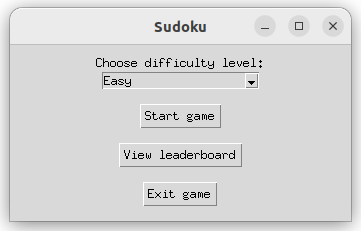
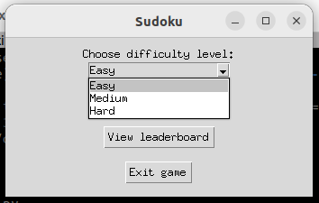
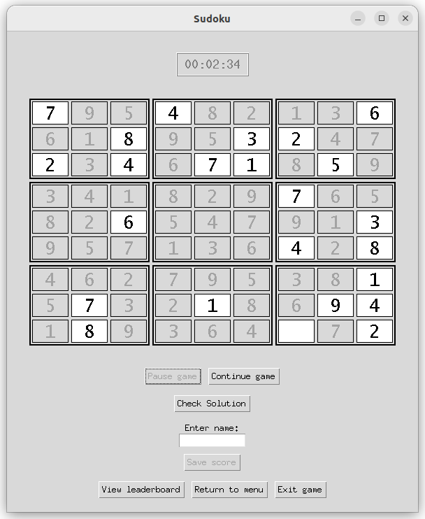
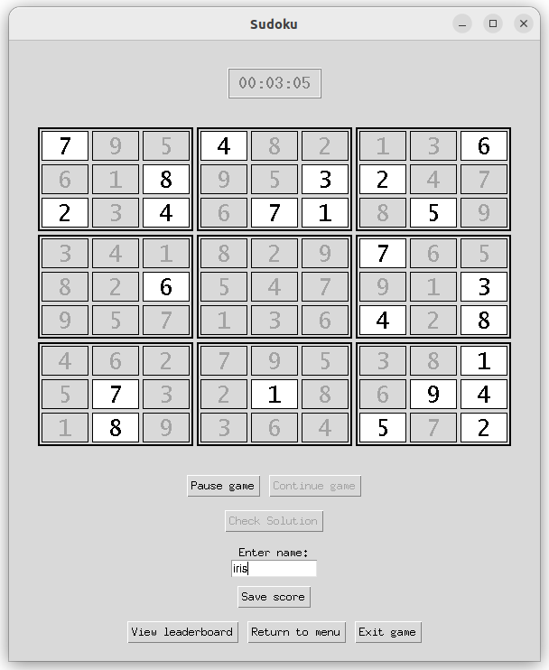
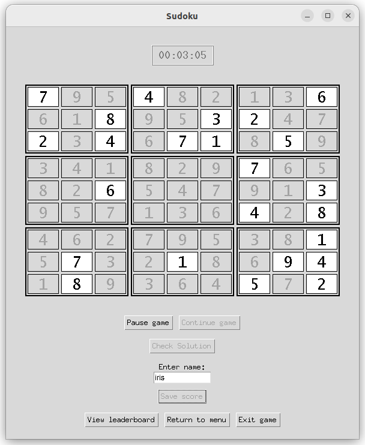
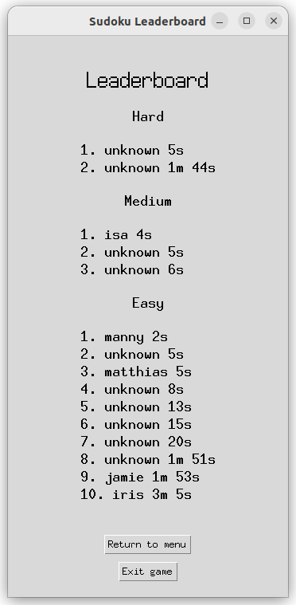

# Käyttöohje

Lataa projektin viimeisimmän releasen lähdekoodi [täältä](https://github.com/uyenmh/ot-harjoitustyo/releases/tag/loppupalautus). Lähdekoodin lataaminen onnistuu valitsemalla Assets-osion alta Source code.

## Konfigurointi

Tallennukseen käytettävän tiedoston nimi on konfiguroitu .env-tiedostossa, joka löytyy käynnistyshakemistosta. Tiedoston nimeä voi halutessa vaihtaa muokkaamalla .env-tiedostoa. Tiedostoa ei löydy lähdekoodin lataamishetkellä, mutta se luodaan automaattisesti data-hakemistoon sovelluksen alustuksessa. .env-tiedosto näyttää lataamishetkellä tältä:

```
DB_FILENAME = sudoku_db.sqlite
```

Tiedoston nimeä muokataan muuttamalla kohtaa "sudoku_db", esim. näin:

```
DB_FILENAME = sudoku_leaderboard.sqlite
```

## Sovelluksen käynnistäminen

Ennen sovelluksen käynnistämistä, sen riippuvuudet tulee asentaa ja tietokanta alustaa.


Riippuvuudet asennetaan komennolla:

```
poetry install
```

Tietokanta alustetaan komennolla:

```
poetry run invoke setup-db
```

Sovellus voidaan käynnistää tämän jälkeen komennolla:

```
poetry run invoke start
```


## Vaikeustason valitseminen ja uuden pelin aloittaminen

Sovellus käynnistyy päävalikkoon:



Pelin vaikeustason valitseminen onnistuu avaamalla alasvetovalikon ja valitsemalla yksi vaihtoehdoista:



Uusi peli voidaan aloittaa painamalla "Start game"-painiketta, joka näkyy ensimmäisessä kuvassa.

## Pelin laittaminen paussille

Pelinäkymä näyttää tältä:


Peli voidaan laittaa paussille painamalla "Pause game"-painiketta.

## Pelin jatkaminen paussista

"Pause game"-painike on nyt pois käytöstä.



Peliä voidaan jatkaa painamalla "Continue game"-painiketta.

## Pelin tarkistaminen

Peli voidaan tarkistaa, missä tahansa vaiheessa painamalla "Check solution"-painiketta.


## Pelituloksen tallentaminen

Kun sudoku ollaan ratkaistu oikein, pelitulos voidaan tallentaa leaderboardiin painamalla "Save score"-painiketta. "Save score"-painikkeen yläpuolella on valkoinen laatikko, johon voidaan kirjoittaa nimi, mutta nimen kirjaaminen ei ole pakollista.



## Leaderboardin tarkastelu

Leaderboardia voidaan tarkastella painamalla "View leaderboard"-painiketta:



Sama painike löytyy myös päävalikosta:


Leaderboard näyttää tältä:



## Päävalikkoon palaaminen

Päävalikkoon voidaan palata, milloin tahansa. Tämä onnistuu painamalla "Return to menu"-painiketta joko leaderboard-näkymästä:


tai pelinäkymästä:


