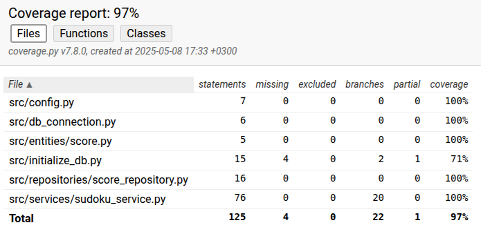

# Testausdokumentti

Sovellusta on testattu sekä yksikkö- että integraatiotasolla unittestillä. Järjestelmätestaus on suoritettu manuaalisesti.

## Yksikkö- ja integraatiotestaus

### Sovelluslogiikka

SudokuService-luokka vastaa sovelluslogiikasta ja tätä testataan TestSudokuService-testiluokalla. Testien käyttöön on luotu FakeScoreRepository-luokka, jonka avulla tietoa voidaan tallentaa muistiin testien aikana. SudokuService-olion alustuksessa sille injektoidaan riippuvuudeksi repositorio-olio FakeScoreRepository-luokkaa käyttäen.

### Repositorio-luokat

ScoreRepository-luokkaa testataan TestScoreRepository-testiluokalla. Testeissä käytetään SQLite:n "kertakäyttöistä" tietokantaa, joka luodaan jokaisen testin alussa ja suljetaan testin lopussa.

### Entities-luokat

Score-luokkaa testataan TestScore-testiluokalla, jonka avulla varmistetaan, että Score-olio luodaan oikein.

### Testauskattavuus

Sovelluksen testauksen haaraumakattavuus on 97%. Testaus ei sisällä käyttöliittymän testausta.

initialize_db.py-tiedostosta on jäänyt testaamatta tietokannan alustus.

## Järjestelmätestaus

Sovellus on testattu manuaalisesti niin, että kaikki [määrittelydokumentin](https://github.com/uyenmh/ot-harjoitustyo/blob/master/dokumentaatio/vaatimusmaarittely.md) ja [käyttöohjeen](https://github.com/uyenmh/ot-harjoitustyo/blob/master/dokumentaatio/kayttoohje.md) listaamat toiminnallisuudet on käyty läpi. Syötteitä ollaan testattu tyhjillä, virheellisillä ja hyväksytyillä arvoilla. 
