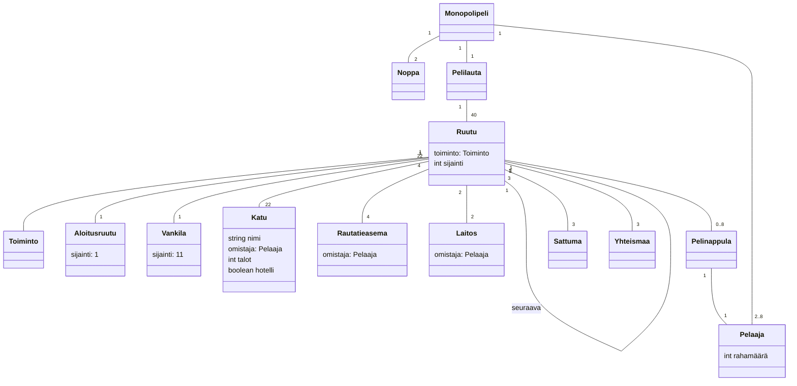

## Monopoli, luokkakaavio

```mermaid
 classDiagram
    class Monopolipeli
    class Noppa
    class Pelilauta
    class Toiminto
    class Ruutu {
        toiminto: Toiminto
        int sijainti
    }
    class Aloitusruutu {
        sijainti: 1
    }
    class Vankila {
        sijainti: 11
    }
    class Katu {
        string nimi
        omistaja: Pelaaja
        int talot
        boolean hotelli
    }
    class Rautatieasema {
        omistaja: Pelaaja
    }
    class Laitos {
        omistaja: Pelaaja
    }
    class Pelaaja {
        int rahamäärä
    }
    Monopolipeli "1" -- "2" Noppa
    Monopolipeli "1" -- "1" Pelilauta
    Pelilauta "1" -- "40" Ruutu
    Ruutu "1" -- "1" Ruutu : seuraava
    Ruutu "1" -- "0..8" Pelinappula
    Pelinappula "1" -- "1" Pelaaja
    Pelaaja "2..8" -- "1" Monopolipeli
    Ruutu "1" -- "1" Aloitusruutu
    Ruutu "1" -- "1" Vankila
    Ruutu "3" -- "3" Sattuma
    Ruutu "3" -- "3" Yhteismaa
    Ruutu "4" -- "4" Rautatieasema
    Ruutu "2" -- "2" Laitos
    Ruutu "22" -- "22" Katu
    Ruutu -- Toiminto
```
